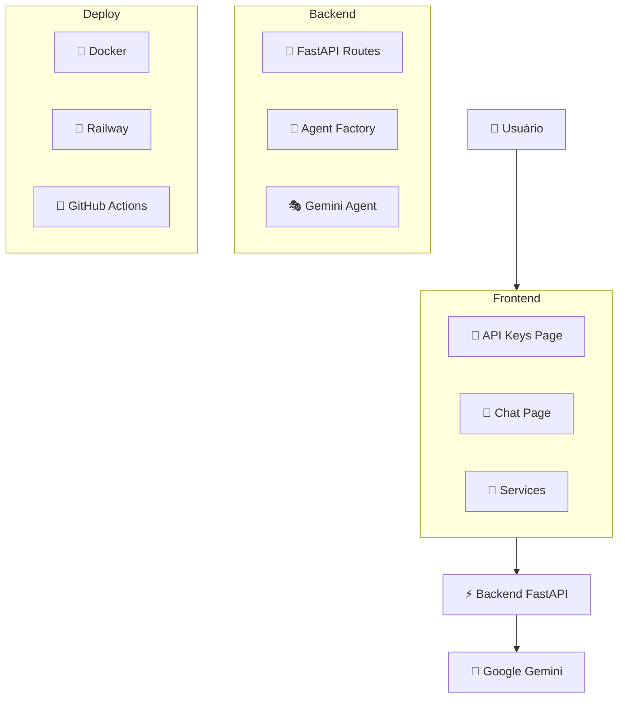
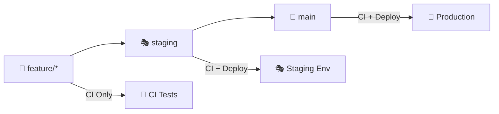

<!-- markdownlint-disable MD024 -->
<!-- markdownlint-disable MD033 -->
# 🧠 LearnIA - Chat com IA Professor de Tecnologia

Um sistema completo de chat com inteligência artificial especializada em ensino de tecnologia, com interface web moderna e API REST robusta.

## ✨ Visão Geral

O LearnIA é uma aplicação full-stack que combina um backend em Python (FastAPI) com um frontend em React, criando uma experiência de chat educativa com modelos de IA. O sistema utiliza um prompt de sistema especializado que transforma a IA em um professor de tecnologia qualificado.

### 🎯 Características Principais

- **🤖 IA Professor**: Prompt especializado para ensino didático de tecnologia
- **📱 Interface Moderna**: Design responsivo com tema escuro
- **🔑 Multi-API**: Suporte a múltiplos provedores de IA (atualmente Gemini)
- **📝 Markdown**: Renderização completa de respostas formatadas
- **🐳 Docker**: Containerização completa para desenvolvimento e produção
- **🚀 CI/CD**: Pipeline automatizada com GitHub Actions
- **☁️ Deploy**: Deploy automatizado para Railway

## 🏗️ Arquitetura



### 🛠️ Stack Tecnológico

#### Frontend

- **React 19** + **TypeScript** - Interface moderna e tipada
- **Vite** - Build tool rápida
- **Tailwind CSS** - Design system consistente
- **React Router** - Roteamento SPA
- **React Markdown** - Renderização de respostas

#### Backend

- **FastAPI** - API REST moderna e rápida
- **Python 3.14+** - Linguagem principal
- **Google Gemini** - Modelo de IA principal
- **UV** - Gerenciador de dependências
- **Pydantic** - Validação de dados

#### DevOps

- **Docker** - Containerização
- **GitHub Actions** - CI/CD
- **Railway** - Hosting e deploy
- **Nginx** - Servidor web (produção)

## 🚀 Quick Start

### 📋 Pré-requisitos

- **Docker** e **Docker Compose**
- **Node.js 20+** (para desenvolvimento frontend)
- **Python 3.14+** (para desenvolvimento backend)
- **Google Gemini API Key**

### 🏃‍♂️ Execução Rápida com Docker

```bash
# Clone o repositório
git clone https://github.com/LucasGdBS/learnIA.git
cd learnIA

# Execute com Docker Compose
docker-compose up -d

# Acesse as aplicações
# Frontend: http://localhost:3000
# Backend:  http://localhost:8000
```

### 🛠️ Desenvolvimento Local

#### Backend

```bash
cd backend
uv sync                           # Instala dependências
uv run uvicorn app.main:app --reload --port 8000
```

#### Frontend

```bash
cd frontend
npm install                       # Instala dependências  
npm run dev                      # Inicia servidor de desenvolvimento
```

## 📖 Documentação Detalhada

- **[📚 Backend API](./backend/app/README.md)** - Documentação completa da API
- **[🎨 Frontend](./frontend/README.md)** - Documentação da interface web
- **[🔄 GitHub Actions](#-github-actions)** - Pipeline de CI/CD

## 🔄 GitHub Actions

O projeto utiliza um pipeline automatizado de CI/CD com 4 workflows principais:

### 1. 🧪 CI Backend (`ci-backend.yml`)

**Triggers:**

- Push em qualquer branch com mudanças em `backend/**`
- Pull requests para `staging` e `main`

**Etapas:**

```yaml
Jobs:
├── 📥 Checkout código
├── 🐍 Instalar UV (gerenciador Python)
├── 📦 Instalar dependências (uv sync --frozen)
├── 🔍 Lint com Ruff
├── 🐳 Build imagem Docker
└── ✅ Validação completa
```

### 2. 🎨 CI Frontend (`ci-frontend.yml`)

**Triggers:**

- Push em qualquer branch com mudanças em `frontend/**`
- Pull requests para `staging` e `main`

**Etapas:**

```yaml
Jobs:
├── 📥 Checkout código
├── 📦 Setup Node.js 20
├── 🔧 Instalar dependências (npm install)
├── 🔍 ESLint
├── 🐳 Build imagem Docker
└── ✅ Validação completa
```

### 3. 🚀 Deploy Production (`deploy-main.yml`)

**Trigger:** Push para branch `main`

**Pipeline Completo:**

```yaml
Pipeline:
├── 🧪 CI Backend (parallel)
├── 🎨 CI Frontend (parallel)
├── 🚀 Deploy Backend → Railway
└── 🌐 Deploy Frontend → Railway
```

**Características:**

- **Dependency Management**: Deploy só executa após CI passar
- **Railway Integration**: Deploy automático usando Railway CLI
- **Service IDs**: Configurados para produção
- **Secrets**: Token Railway armazenado em GitHub Secrets

### 4. 🎭 Deploy Staging (`deploy-staging.yml`)

**Trigger:** Push para branch `staging`

**Pipeline:** Idêntico ao production, mas para ambiente de staging

### 🔧 Configuração dos Workflows

#### Secrets Necessários

```bash
# GitHub Repository Secrets
RAILWAY_MAIN_TOKEN     # Token para produção
RAILWAY_STAGING_TOKEN  # Token para staging
```

#### Service IDs Railway

```yaml
# Produção
Backend Service
Frontend Service

# Staging 
Backend Service
Frontend Service
```

### 📊 Fluxo de Branches



### ✅ Status do Pipeline

- **✅ CI Backend**: Lint com Ruff + Docker build
- **✅ CI Frontend**: ESLint + Docker build  
- **✅ Deploy Production**: CI + Railway deploy
- **✅ Deploy Staging**: CI + Railway deploy
- **⏳ Testes**: Em desenvolvimento

## 📁 Estrutura do Projeto

```yaml
learnIA/
├── 📁 .github/workflows/      # GitHub Actions
│   ├── ci-backend.yml        # CI do backend
│   ├── ci-frontend.yml       # CI do frontend
│   ├── deploy-main.yml       # Deploy produção
│   └── deploy-staging.yml    # Deploy staging
├── 📁 backend/               # API FastAPI
│   ├── app/
│   │   ├── AIChat/           # Módulo de IA
│   │   ├── main.py          # App principal
│   │   └── ...
│   ├── Dockerfile           # Container backend
│   └── pyproject.toml       # Dependências Python
├── 📁 frontend/             # App React
│   ├── src/
│   │   ├── components/      # Componentes
│   │   ├── pages/          # Páginas
│   │   ├── services/       # APIs
│   │   └── ...
│   ├── Dockerfile          # Container frontend
│   └── package.json        # Dependências Node
├── docker-compose.yml      # Orquestração local
└── README.md              # Documentação principal
```

## 🎓 Como Usar

### 1. **Configurar API Key**

- Acesse `http://localhost:3000`
- Adicione sua Google Gemini API key
- Teste a conexão

### 2. **Conversar com a IA**

- Vá para a página de Chat
- Selecione a API key configurada
- Digite sua pergunta sobre tecnologia

### 3. **Professor de Tecnologia**

O sistema automaticamente usa um prompt que transforma a IA em:

- 👨‍🏫 Professor especializado em tecnologia
- 📖 Explicações didáticas e claras
- 🛠️ Foco em boas práticas
- 💡 Exemplos práticos
- 🎯 Respostas de tamanho médio (5-12 linhas)

## 🔒 Segurança

- **🔐 API Keys**: Armazenadas localmente no browser
- **🛡️ CORS**: Configurado adequadamente
- **✅ Validação**: Pydantic para entrada de dados
- **🔒 HTTPS**: Comunicação segura em produção

## 📊 Monitoramento

### Logs Estruturados

- 📝 Requisições HTTP
- ❌ Erros de integração
- ⚡ Performance metrics
- 🔍 Debug information

### Healthchecks

- ✅ Status da API
- 🔗 Conectividade com modelos
- 📊 Métricas de uso

## 🚀 Deploy e Produção

### Railway (Atual)

- **Backend**: `https://learnai-backend.railway.app`
- **Frontend**: `https://learnai-frontend.railway.app`
- **Deploy**: Automático via GitHub Actions

### Alternativas

- **Docker Compose**: Para ambiente local
- **AWS/GCP**: Para maior escala
- **Vercel/Netlify**: Para frontend estático

## 🔄 Roadmap

### 🎯 Próximas Funcionalidades

#### Backend Tasks

- [ ] ✅ Testes automatizados (pytest)
- [ ] 📊 Métricas e observabilidade
- [ ] 🔄 Rate limiting
- [ ] 💾 Cache de respostas
- [ ] 🎮 Streaming de respostas
- [ ] 🤖 Integração OpenAI GPT

#### Frontend Tasks

- [ ] 🎨 Temas personalizáveis
- [ ] 📤 Exportação de conversas
- [ ] 📚 Histórico de sessões
- [ ] 📎 Upload de arquivos
- [ ] 📱 PWA (Progressive Web App)
- [ ] ⌨️ Atalhos de teclado avançados

#### DevOps Tasks

- [ ] 🧪 Testes E2E
- [ ] 🐳 K8s deployment
- [ ] 📊 Monitoring dashboard
- [ ] 🚨 Alertas automáticos

### 🏆 Versões Planejadas

- **v1.1**: Testes + OpenAI integration
- **v1.2**: PWA + Exportação
- **v2.0**: Multi-model + Streaming
- **v2.1**: File uploads + Advanced UX

## 🤝 Contribuindo

1. **Fork** o projeto
2. **Crie** uma branch feature (`git checkout -b feature/nova-funcionalidade`)
3. **Commit** suas mudanças (`git commit -m 'Add: nova funcionalidade'`)
4. **Push** para a branch (`git push origin feature/nova-funcionalidade`)
5. **Abra** um Pull Request

### 📋 Guidelines

- 🧪 Adicione testes para novas funcionalidades
- 📝 Mantenha a documentação atualizada
- 🔍 Siga os padrões de lint configurados
- 📏 Respeite a arquitetura existente

## 📞 Suporte

- **📧 Issues**: Use GitHub Issues para bugs e sugestões
- **💬 Discussões**: GitHub Discussions para dúvidas gerais
- **📚 Docs**: Consulte a documentação de cada módulo

## 📄 Licença

Este projeto está sob a licença MIT. Veja o arquivo [LICENSE](LICENSE) para mais detalhes.

---

<div align="center">

**🧠 LearnIA** - *Aprendendo tecnologia com IA*

[](https://github.com/LucasGdBS/learnIA/actions)
[](https://github.com/LucasGdBS/learnIA/actions)

[🚀 Demo](https://learnia-front-main.up.railway.app) • [📚 Docs](https://learnia.up.railway.app/docs) • [🐛 Issues](https://github.com/LucasGdBS/learnIA/issues)

</div>
